# Snake_game
Snake game implemented on the DE1-SoC

## Table of Contents
- [Objectives](#objectives)
- [Introduction](#introduction)
- [Top Snake Game](#top-snake-game---top_snake_gamesv)
- [Switch Debounce](#switch-debounce---switch_debouncesv)
- [Button Sync](#button-sync---button_syncsv)
- [Init Screen](#init-screen---init_screensv)
- [Game Path](#game-path---game_pathsv)
  - [Simple Dual Port RAM](#simple-dual-port-ram---simple_dual_port_ramsv)
  - [Main State Machine](#main-state-machine)
  - [Last Pushed Direction](#last-pushed-direction)
  - [Linear Feedback Shift Register](#linear-feedback-shift-register)
- [Game Plot](#game-plot---game_plotsv)
- [Hex Display](#hex-display---hex_displaysv)
- [VGA IP](#hex-display---hex_displaysv)
- [Timing Closure](#timing-closure)


## Objectives

- Gain experience with System Verilog design and verification
- Research and Implement Clock Domain Crossing techniques
- Integrate external IP into a project
- Learn about Timing Constraints and achieve Timing Closure
- Gain experience Inferring Memory blocks within HDL code 
- Explore and implement Randomization in hardware
- Improve project skills from beginning to end:
  - Idea creation
  - Design and implementation
  - Research
  - Verification
  - Iteration
  - Technical writeup and presentation


## Introduction

This project was created to implement a snake game in hardware on the [De1-SoC development board](https://www.terasic.com.tw/cgi-bin/page/archive.pl?Language=English&CategoryNo=205&No=836&PartNo=1#contents).

**<ins>Description of the Snake Game:</ins>**

  **Mechanics:** A snake that moves on a grid. The direction the snake moves is controlled by the player. At each time step, the head moves forward one square and the tail follows one square. 

  **Objective:** The objective of the game is to collect a Point on the grid. If the snake runs into the Point, the length of the snake increases by one square, and a new Point is plotted at random. Note: 'Apple' is sometimes used synonymously with 'Point' within the code.

  **Challenge:** The snake must avoid both the walls of the grid and the snake tail that is trailing behind the snake head. If the snake collides with either, the game is over.

https://github.com/user-attachments/assets/b48ee1c6-1af1-48ac-a919-0df670f72795

If above video does not work it is available to download here: [Download Snake Game Movie](supplemental/snake_game_movie.MOV)
  
The file structure of the project is as follows:

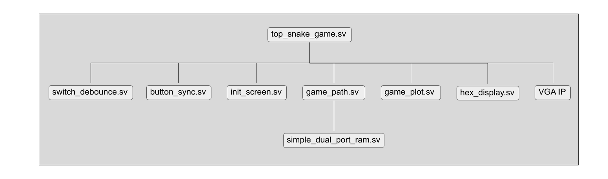


## Top Snake Game - top_snake_game.sv

A basic flow structure of Top Snake Game is as follows:

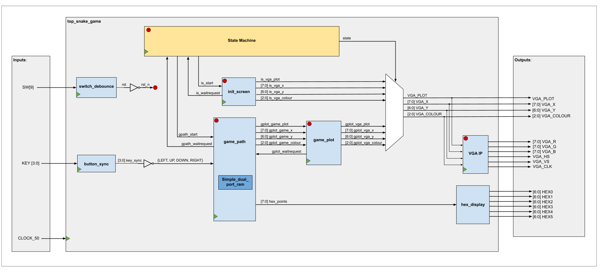

A diagram of the state machine is as follows:

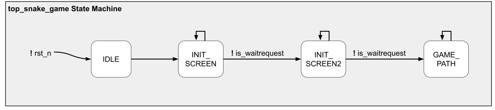

A brief description of each state is as follows:

- IDLE: Prompt init_screen to begin, move to INIT_SCREEN state
- INIT_SCREEN: Wait for init_screen to accept prompt, move to INIT_SCREEN2
- INIT_SCREEN2: Wait for init_screen to finish, prompt game_path to start
- GAME_PATH: Stay in this state where game_path is running


## Switch Debounce - switch_debounce.sv

The Switch Debounce module is created to first synchronize the input from SW[9] on the DE1-SoC board and then debounce the output of the synchronizer. This signal is used as a reset to the entire system. Note: SW[9] is completely asynchronous.

The synchronizer is implemented using two flip flops in series. The debounce circuit is implemented using a counter to enable a final flip flop. This enable is turned on when the counter is greater than or equal to a value specified as a parameter passed to this module.

The counter is only triggered when the output of the synchronizer and the output of the debounce flip flop are not equal. 

Since the switch is driven by human control, it will be much slower than the clock speed of the FPGA and there is no concern about loss of data. 

A diagram of the Switch Debounce Circuit can be seen below:

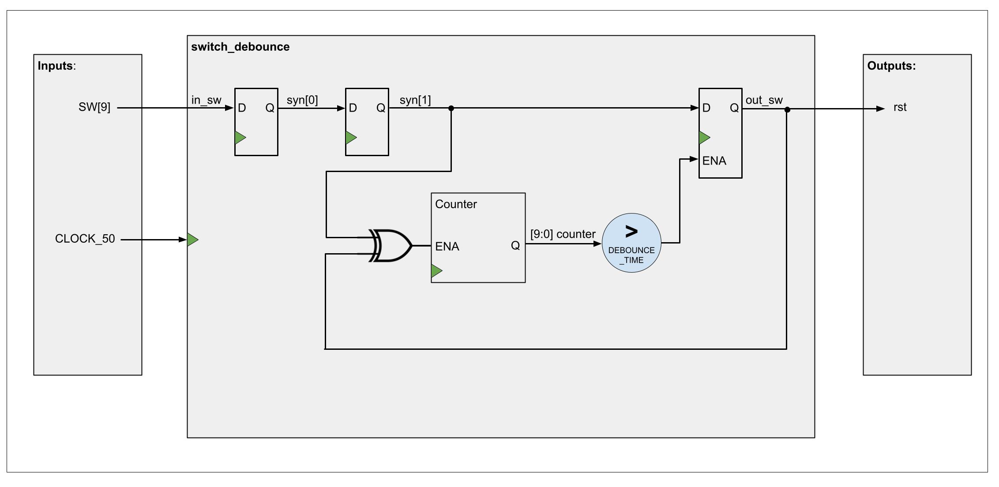


## Button Sync - button_sync.sv

The Button Sync module implements synchronizers for each of the 4 buttons on the DE1-SoC board which are used to control the direction of the snake and the game. These 4 buttons are completely asynchronous. 

Technically there could be issues with these input 'data packets' of the buttons crossing into the FPGA clock domain, i.e. the 'data packet' of sampled buttons at the input of the synchronizer may not all appear on the output of the synchronizer at the same time due to potential metastability and subsequent settling. This, however, is not a concern as these buttons are human controlled and the difference of one single 20 ns clock cycle is negligible compared to the human reaction speed of 250 ms.

Also note that these inputs are not debounced as they have already been debounced externally by a Schmitt Trigger on the board.

A diagram of the Button Sync circuit can be see below:

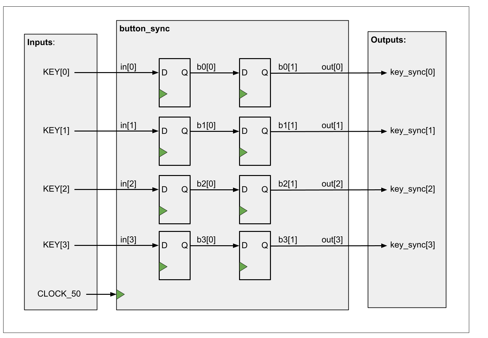


## Init Screen - init_screen.sv

The purpose of Init Screen is to drive the VGA to plot the background of the Snake Game.

Init Screen follows a waitrequest protocol. When waitrequest is high, init screen is unable to process a start command. Once waitrequest is low, it is able to process a start command. Once it receives the start command, it will begin outputting data to drive the VGA, and will set its waitrequest high again.

The protocol can be seen in detail with waveforms below:

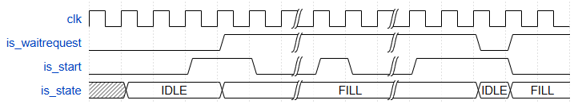

The way that Init Screen works is it cycles x and y coordinates through (0,0) to (159,119) (all of the pixels on the VGA) and uses comparators to determine if the pixel should be black (background) or white (border of game grid). A code snippet of the comparators is shown below:

```systemverilog
                //to set up outline, set up a width of the outline as 6 pixels
                // x axis: [26-31] left outline and [128-133] right outline
                // y axis: [6-11] top outline and [108-113] bottom outline
                if( x >= 8'd26 && x <= 8'd133 && y >= 7'd6 && y <= 7'd113) begin
                    if( x >= 8'd32 && x <= 8'd127 && y >= 7'd12 && y <= 7'd107) begin
                        //inside colour
                        vga_colour = 3'b000;
                    end
                    else begin
                        //outline colour
                        vga_colour = 3'b111;
                    end
                end
                else begin
                    //outside colour
                    vga_colour = 3'b000;
                end
```

The final product of a properly displayed background can be seen below:

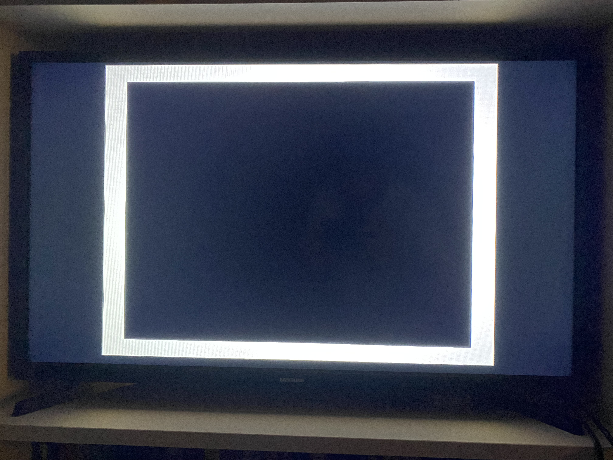

The flow of data in Init Screen can be seen in the diagram below:

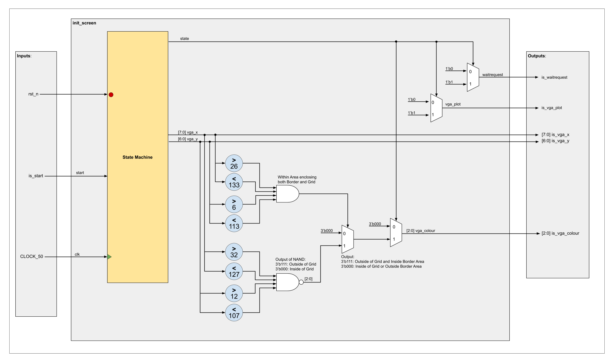

The State Machine of Init Screen is shown below:

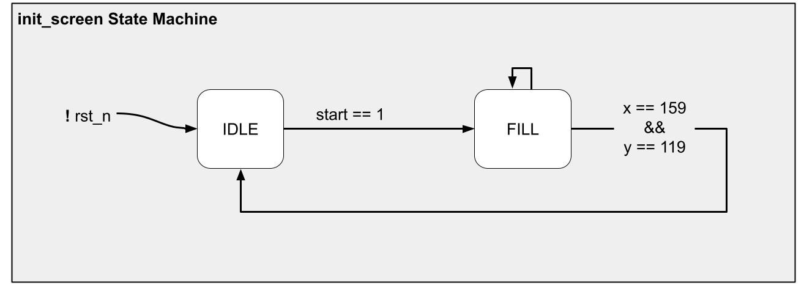

A brief description of each state is as follows:

- IDLE: Wait for starting protocol to be received then set x=0, y=0, and move to FILL
- FILL: Cycle through each pixel coordinate, (x,y) = (0,0) to (159,119), then return to IDLE


## Game Path - game_path.sv

Game Path is used as the brain of a snake game. This module is what converts the user inputs into the game that is displayed to the player. This module processes the user buttons as inputs, and drives the game pixels that will be displayed on the VGA and the player score displayed on the hex display. 

Note that the game pixels are passed to the game_plot module who interacts with the VGA IP to display on the VGA. Also note that the player score is provided to the hex_display module that drives the 7-segment hex display.

This module not only processes the game, but also processes the start, end, and reset of a game.

Note that Game Path follows the same protocol as Init Screen.

The general data flow of game_path, it's nested memory module, and blocks of logic can be seen in the diagram below:

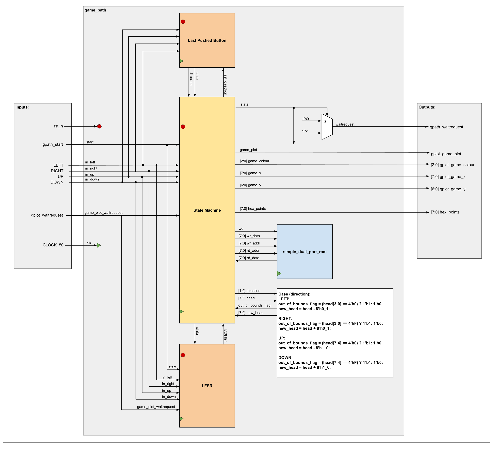

The Simple Dual Port RAM, State Machine, Last Pushed Direction, and LFSR blocks will be described in depth below.


### Simple Dual Port RAM - simple_dual_port_ram.sv
The Simple Dual Port RAM module is created to infer RAM within a code block. This memory is created to utilize the M10K memory block available on the Cyclone V FPGA. It is also inferred to utilize pass through logic when reading and writing to the same cell within the same clock cycle.

The memory inferred is 8X256 bits, and is a simple dual port memory, meaning that one port can write to the memory each clock cycle, and one port can read from the memory each clock cycle.

In the context of the game, this memory is used to implement FIFO memory with 256 available spots to hold an 8-bit location refering to one square on the game grid. This memory is used to hold the location of each segment of the snake in order from head to tail. At each game step, we add a new 8-bit head location and read the tail location if applicable.


### Main State Machine

The state machine of Game Path can be seen below:

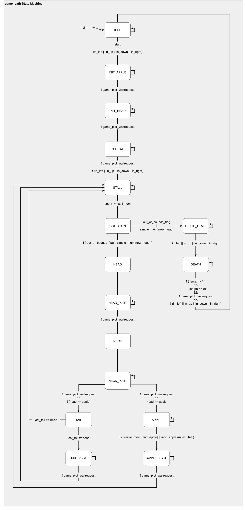

A brief description of each state's function can be found below:

- IDLE:
  - Wait for starting protocol and a user button to be pushed.
    - stall_num = STALL_BASE, head = (7,1), last_tail = (7,0), apple = (8,8), direction = DOWN, length = 2, hex_points = 0, write head to FIFO RAM, set wr_ptr and rd_ptr for FIFO RAM, write head to simple_mem, give command to plot apple pixel red
    - Move to INIT_APPLE
- INIT_APPLE:
  - End write to RAM 
  - Wait for apple plot command to be received by game_plot.
    - Give command to plot head pixel green
    - Move to INIT_HEAD
- INIT_HEAD:
  - Wait for head plot command to be received by game_plot.
      - Give command to plot tail pixel white
      - Move to INIT_TAIL
- INIT_TAIL:
  - Wait for tail plot command to be received by game_plot.
    - End plotting
    - Wait for all user buttons to be released.
      - Set count = 0
      - Move to STALL 
- STALL:
  - Increase count until greater than stall_num
    - Update direction = last_direction (from last_pushed direction)
    - Move to COLLISION
- COLLISION:
  - If snake is out of bounds or new_head collides with the snake body
    - Read tail from FIFO RAM, update rd_ptr = rd_ptr + 1
    - Move to DEATH_STALL
  - Else
    - Update head = new_head, neck = (old) head, read tail from FIFO RAM
    - Move to HEAD
- HEAD:
  - Write head to FIFO RAM, write head to simple_mem, give command to plot head pixel green
  - Move to HEAD_PLOT
- HEAD_PLOT:
  - End write to RAM
  - Wait for head plot command to be received by game_plot.
    - End plotting
    - Move to NECK
- NECK:
  - Give command to plot neck pixel white (covering up previous green head)
  - Move to NECK_PLOT
- NECK_PLOT:
  - Wait for neck plot command to be received by game_plot.
    - End plotting
    - If head is on the apple
      - rand_apple = [7:0] lfsr, length = length + 1, hex_points = hex_points + 1
      - Move to APPLE
    - Else
      - Move to TAIL
- TAIL:
  - Update last_tail <= rd_data(tail), rd_ptr = rd_ptr + 1, clear rd_data(tail) from simple_mem (Note non-blocking is specified here for clarity, though all assignments in this state machine are non-blocking)
  - If (previous) last_tail is not where (the new) head has just been plotted
    - Give command to plot (previous) last_tail black, covering it
    - Move to TAIL_PLOT
  - Else (the new head has already covered the previous last tail)
    - Set count = 0
    - Move to STALL
- TAIL_PLOT:
  - Wait for tail plot command to be received by game_plot.
    - End plotting, set count = 0
    - Move to STALL
- APPLE:
  - If rand_apple falls on a segment of the snake
    - Update rand_apple = rand_apple + 7 (Note 7 chosen as likelihood of adjacent square to also be part of snake is high, increments of 7 spread nicely over grid)
  - Else
    - Update apple = rand_apple, give command to plot new random apple red
    - Move to APPLE_PLOT
- APPLE_PLOT:
  - Wait for apple plot command to be received by game_plot.
    - End plotting, update stall_num = stall_num - STALL_DECR (to make game go faster as more points are collected), set count = 0
    - Move to STALL
- DEATH_STALL:
  - Wait for user button to be pushed. (Allows user to see how they died in the game)
    - Give command to plot last_tail black, covering it
    - Move to DEATH
- DEATH:
  - If length > 1
    - Wait for previous cover plot command to be received by game_plot.
      - Give command to plot rd_data(body segment) black, covering it, length = length - 1, read next body segment from FIFO RAM, update rd_ptr = rd_ptr + 1 (Note read takes 2 cycles, but plot command takes 16, thus it is not an issue)
  - Else If length == 1 (Note we did not decrease length while covering last_tail, thus allowing one extra to cover apple)
    - Wait for previous cover plot command to be received by game_plot.
      - Give command to plot apple black, covering it, length = length - 1
  - Else
    - Wait for previous cover plot command to be received by game_plot.
      - Wait for all user buttons to be released.
        - Clear simple_mem (Note FIFO RAM does not need to be cleared as it will be written over before it is read in the next game)
        - Move to IDLE

Note that two types of memory are used to store the snake. The FIFO RAM uses 256x8 bits to store the snake segments in order from head to tail, simple_mem uses 256 bits to indicate if a location on the 16x16 game grid is occupied by the snake.

To further clarify the states and their relation to the tracking and movement of the snake, the following diagrams are provided:

(Note that the snakes are represented in a horizontal line for simplification)

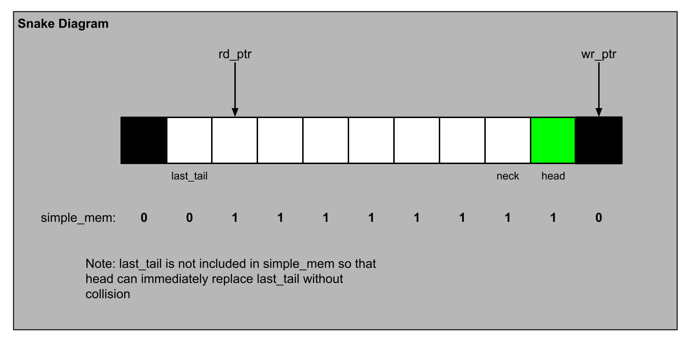

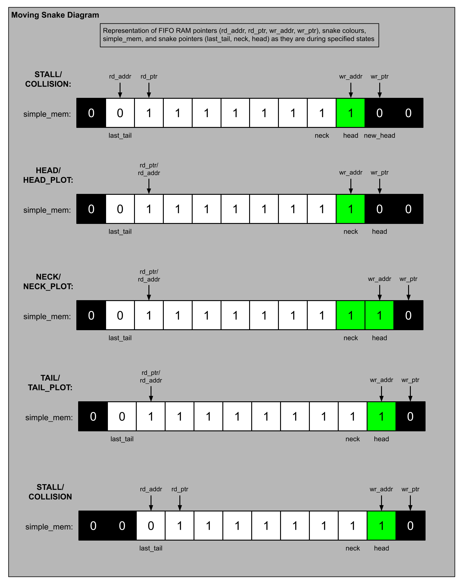

Note that all of the above states will happen fast enough that the elongated form of the snake should not be notable.

Also note if the head runs into an apple, tail will not be covered black, and rd_ptr will not be increased, thus elongating the snake as a Point is collected.


### Last Pushed Direction

The Last Pushed Direction section of the code determines what the last button that was pushed is, and thus what direction the user has specified the snake should go in.

The snake however is not allowed to turn 180 degrees back on itself, thus we must take into account the direction the snake is currently headed in, in this case denoted 'direction'.

Note: last_direction is forced to DOWN when in INIT_TAIL state so that the game begins with the snake travelling downward.

The code can be seen below:

( 'in_down, in_left, in_right, in_up' refer to user inputs on buttons; 'direction' is used to indicate current direction of snake, 'last_direction' captures the direction the user indicates the snake should move in next)

```systemverilog
   enum logic [1:0] {LEFT, RIGHT, UP, DOWN} last_direction, direction;
    //sequential
    //synchronous reset
    //drives last_direction
    always_ff@(posedge clk) begin
        //does not allow change in direction by 180 degrees
        if(!rst_n || state == INIT_TAIL || (in_down && direction != UP))
            last_direction <= DOWN;
        else if(in_left && direction != RIGHT)
            last_direction <= LEFT;
        else if(in_right && direction != LEFT)
            last_direction <= RIGHT;
        else if(in_up && direction != DOWN)
            last_direction <= UP;
        
    end
```

Note that there is a hierarchy of which button will be remembered if multiple are pressed at once. I believe this does not take away from the gameplay as it is the player's error if they have multiple buttons pushed at once. Since the clock speed sampling the user input is also much faster than human reaction time, if the player fixes their input, their fixed input will be captured.


### Linear Feedback Shift Register

A linear feedback shift register (LFSR) is a common device used to generate psuedo-random sequences in computers. The size of the LFSR determines how many cycles the LFSR can continue to generate new outputs before repeating the sequence. The seed determines where in this sequence the LFSR begins.

In the context of the game, this LFSR is used to generate a random location to place the next Point square when a Point is collected.

In order for the Point location to be random and the sequence to not repeat itself within the game, we need 256 * 8 random bits (256 since a maximum of 254 Points can be collected before the snake occupies the entire grid, and 8 since each location is referenced by an 8 bit number). Thus, we need 2^11 random bits, which can be generated from an 11-bit LFSR.

Note an 11-bit LFSR can only generate 2^11 - 1 random numbers as it will never generate an output of all 1's if implemented with an XNOR.

The implementation of an 11-bit LFSR can be seen below:

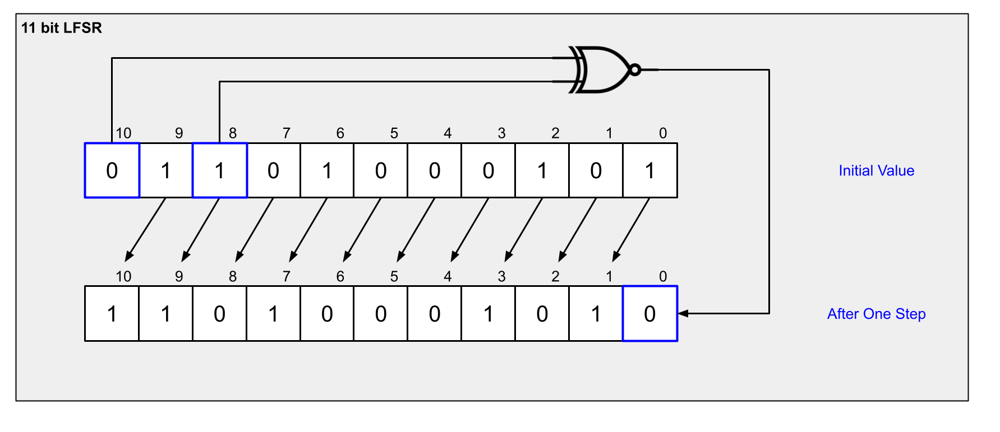

In code:
```systemverilog
lfsr <= {lfsr[9:0],~(lfsr[10] ^ lfsr[8])}; //shift and xnor for the new bit
```

To generate 8 new random bits each time a location for a new Point is needed, the LFSR shifts 8 times.

The other challenge to create a random sequence within the game is creating a random seed for the LFSR sequence. To create this random seed, I use an 11 bit counter. In order to begin the game, the user must press a button, after which, while a button (typically the one to start the game, but could technically be any) is pressed, the counter continues to count until all buttons are released. The value that the counter ends at is used as the seed. This allows a truly random input to seed the LFSR, making it fairly random. The fact that the counter is counting very fast compared to the time that a button will be pressed also adds to this randomness.

The code for capturing the seed can be seen below:

```systemverilog
           //Creating random seed once per game
                //wait for first button push out of idle to start counting
                if (state == IDLE && start) begin  //skip as soon as state is out of IDLE
                    seed_count_flag <= 1'b1;
                    seed_count <= 11'd0;
                end
                else if (seed_count_flag) begin
                    if(in_left || in_up || in_down || in_right ) begin
                        seed_count <= seed_count + 11'd1; //if initial press is still ongoing, count
                    end
                    else begin //get here once no button is being pushed, keep seed_count by turning off flag
                        seed_count_flag <= 1'b0; //if initial press is released, stop counting, seed has been generated 'randomly'
                        if(seed_count == 11'b111_1111_1111) begin //cannot use all 1's for xnor lfsr
                            lfsr <= 11'd0;
                        end
                        else begin
                            lfsr <= seed_count;
                        end
                    end
                end

```


## Game Plot - game_plot.sv

Game Plot translates the plotting requests by Game Path into coordinates that the VGA can plot.

Game Path thinks in logic terms of a 16x16 grid for its game logic, and its outputs aimed to drive the VGA are also in this 16x16 grid format. Game Plot's goal is to translate this 16x16 grid format to the actual VGA coordinates on screen.

Game Path's 16x16 grid is represented with 96x96 VGA pixels, where each square of Game Path's grid is made up of 6x6 VGA pixels.

Note that the entire VGA grid is 159x119, but the box plotted by init_screen outlines this 96x96 pixel grid.

Game Plot follows a waitrequest protocol. This is the same protocol as displayed in Init Screen.

Game Plot's data flow can be seen below:

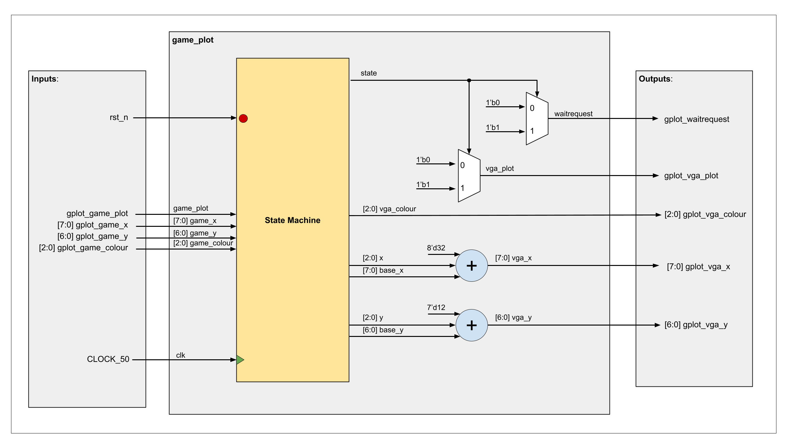

Game Plot's state machine can be seen below:

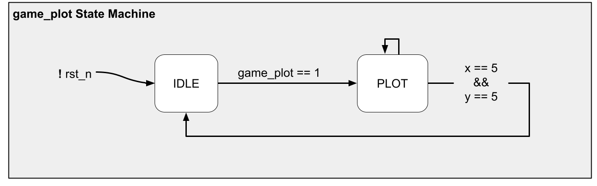

A brief description of each state is provided below:

- IDLE: Wait for starting protocol to be received, save the given colour, calculate 'base_x' and 'base_y' of the vga grid corresponding to the given 'game_x' and 'game_y' of the game grid, set pixel loop parameters x and y to 0.
- PLOT: Cycle through VGA pixel loop parameters (x,y) = (0,0) to (5,5) to go through each VGA pixel in the game grid square, then return to IDLE.


## Hex Display - hex_display.sv

Hex Display's aim is to display the score of a player while playing the game in Hexadecimal format. 

Hex Display can be used to display an inputed number on the boards' 7 segment hex display in hexadecimal format. This instantiation leaves four of the board's 7-segment hex's blank and displays on just two of them as the maximum attainable score of 254 can be represented with just two hexadecimal numbers.

This module is purely combinational.

Please note that although the module is written to be able to display on all 6 7-segment hex displays, the Parameter given in this project's instantiation specifies that only two of the displays will be used, and thus the other 4 will be hard coded to be blank.

Hex Display's data flow diagram can be seen below:

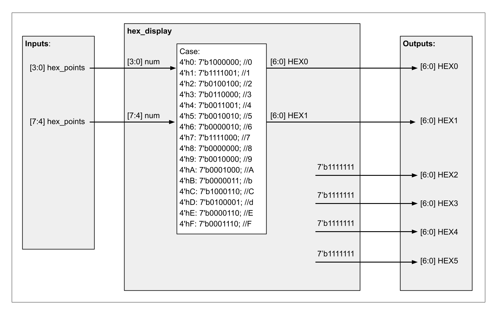


## VGA IP

The VGA core used in this project was developed at the University of Toronto. This core was introduced to me in the CPEN 311 course at the University of British Columbia. The original website can be found here: [https://www.eecg.utoronto.ca/~jayar/ece241_07F/vga/](https://www.eecg.utoronto.ca/~jayar/ece241_07F/vga/).

The files necessary for this VGA IP are:
- vga_adapter.sv
- vga_address_translator.sv
- vga_controller.sv
- vga_pll.sv

The Black Box diagram of the VGA IP can be seen below:

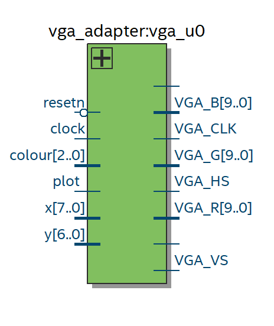


## Timing Closure

In order to close Timing on the design, an SDC file is needed to constrain the design in Quartus.

All input paths, output paths must be constrained, and all clocks within the design must be defined.

Inputs to the design:
- KEY[3:0]
- SW[9]

Outputs from the design:
- [6:0] HEX0
- [6:0] HEX1
- [6:0] HEX2
- [6:0] HEX3
- [6:0] HEX4
- [6:0] HEX5
- VGA_PLOT
- [7:0] VGA_X
- [6:0] VGA_Y
- [2:0] VGA_COLOUR
- [7:0] VGA_R
- [7:0] VGA_G
- [7:0] VGA_B
- VGA_HS
- VGA_VS
- VGA_CLK

Clocks:
50 Mhz CLOCK_50

25 MHz Clock used within VGA IP

Both Inputs are fully asynchronous, so in order to constrain them, I added Maximum path delay parameters so that the paths were not mapped unecessarily long. Since the hold times did not matter, I set them as false paths.

To constrain the path between each register within the design, the clocks need to be defined. In order to do this I specified CLOCK_50 as having a period of 20 ns (50 MHz) and allowed the PLL clocks to be derived.

The Hex outputs are completely asynchronous, thus to make sure the paths were not unnecessarily long, I constrained the Max Delay values, and set the hold delays as false paths as they do not matter.

The VGA outputs proved to be the most important paths to constrain. These outputs were headed for a [VGA DAC ADV7123](https://www.analog.com/media/en/technical-documentation/data-sheets/ADV7123-EP.pdf) chip on the board who's clock is driven by VGA_CLK output. All of the VGA outputs therefore are latched by a 25 Mhz clk and require specific timing parameters.

The VGA_CLK port is a clock, and thus does not need to be constrainted.

To constraint the rest of the VGA Outputs, I specified 'set_output_delay' -max and -min values.

The Output delay calculations are as follows:

Output Delay Max = Board Delay Max - Board Clock Skew Min + Time setup
  Where: Board Clock Skew Min = Minimum External Clock Delay to the External Device - Maximum External Clock Delay to the FPGA

Output Delay Min = Board Delay Min - Board Clock Skew Max - Time hold
  Where: Board Clock Skew Max = Maximum External Clock Delay to the External Device - Minimum External Clock Delay to the FPGA

Unfortunately the board delay parameters are not available for the DE1-SoC, thus I assume the board delay is 0.13 ns, a calculation assuming board delay is about .65 ns/cm travelled. 2 cm based on measurement of the board, from the FPGA to the VGA DAC.

The Setup and Hold time are taken from the VGA DAC specsheet.

The Clock Skew values were then calculated. Since the Clock driving the latch on the VGA DAC is VGA_CLK, derived from a PLL on the FPGA, I specified the External CLock Delay to the FPGA as 0. I specified the External Clock Delay to the External Device to be the same as board delay, since VGA_CLK will have to travel the same distance from the FPGA to the VGA DAC as the other signals.

The Board Delay values and Board Clock Skew values thus cancel each other out, so this estimation of board delay is not important in the end.


